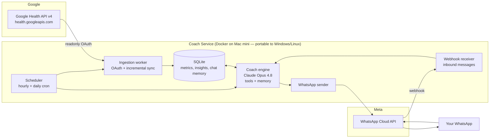

# Personal Google Health AI Coach — Design

A self-hosted service that pulls your Google Health (Fitbit / Pixel Watch) data hourly, mirrors the coaching features of **Google Health Premium Coach** using Claude as the AI engine, and delivers summaries and nudges to your **WhatsApp** chat — with two-way conversation support.

*Designed: 2026-07-14, based on the API landscape as of that date.*

---

## 1. Research findings (why the stack looks like this)

| Question | Finding |
|---|---|
| How do I read Google Health data programmatically? | The **Google Health API** (`https://health.googleapis.com/v4/`) is the current, supported path. It launched in 2026 as the unified successor to both the Google Fit REST API (closed to new signups since May 2024, sunset end of 2026) and the Fitbit Web API (**shuts down September 2026**). It returns data from all Fitbit devices and Pixel Watches. |
| Auth model | Standard **Google OAuth 2.0** with `googlehealth.*` readonly scopes (activity_and_fitness, sleep, health_metrics_and_measurements). Scopes are classified "Restricted" for published apps, but a personal-use OAuth app in *Testing* mode with yourself as the only test user needs no verification review. |
| Data available | 31+ data types via four read methods: `list` (raw points), `reconcile` (merged across devices — matches what the Fitbit app shows), `rollUp` (windowed aggregates), `dailyRollUp` (civil-day aggregates). Heart rate at ~5-second resolution, sleep sessions with stages, steps, calories, resting HR; HRV, SpO₂, ECG, and more landing through Q2–Q3 2026. |
| What does Google Health Premium Coach actually do? | (So we can mirror it.) Launched May 2026 at $9.99/mo: proactive daily insights and nudges on the Today tab; tailored workout suggestions and multi-week adaptive plans; sleep consistency tracking and restorative-rest goals; readiness/recovery analysis; cycle & nutrition insights; medical-record summaries; 24/7 conversational coach with memory of your goals that learns from feedback. |
| How do I send to WhatsApp? | **Meta WhatsApp Cloud API** (the only integration path since Oct 2025). Free tier without business verification: up to 250 business-initiated conversations per rolling 24 h and 2 phone numbers — far more than a personal coach needs. Utility template messages are free inside an open 24-hour service window, and user-initiated (service) conversations are free and unlimited. |
| Two-way chat? | Cloud API webhooks deliver inbound messages to our server. Any reply within 24 h of the user's last message is a free-form message (no template needed). This makes the "chat with your coach" feature natural: you message the coach, the coach replies — and every message you send re-opens the free window for the next day's summaries. |

**Key deadline:** anything built on the legacy Fitbit Web API dies September 2026. Building directly on the Google Health API avoids a forced migration two months in.

---

## 2. Architecture



Three loops share one data store and one coach engine:

1. **Hourly loop** — sync new data; run cheap rule-based checks; call the coach only when a nudge condition fires.
2. **Daily loop** — morning summary (yesterday + sleep + today's plan); optional evening wind-down message.
3. **Chat loop** — event-driven; inbound WhatsApp message → coach agent with conversation memory → reply.

---

## 3. Component design

### 3.1 Ingestion (Google Health API)

- **OAuth setup (one-time):** Google Cloud project → enable Google Health API → OAuth consent screen in *Testing* mode with your account as test user → Desktop-app OAuth client → run a local auth flow once, persist the refresh token.
- **Scopes:** `googlehealth.activity_and_fitness.readonly`, `googlehealth.sleep.readonly`, `googlehealth.health_metrics_and_measurements.readonly`. Do **not** pass `include_granted_scopes=true` (known token-rejection issue when legacy `fitness.*` scopes were previously granted).
- **Sync strategy (hourly):**
  - `dailyRollUp` for steps, calories, active-zone minutes, resting HR — today and yesterday (device sync lag means late-arriving data; always re-fetch a 48 h window).
  - `reconcile` stream for heart rate at reduced resolution (5-min buckets are plenty for coaching; the raw ~5 s stream is ~8,700 points/day — store aggregates, not raw).
  - Session reads for sleep (stages: DEEP/LIGHT/REM/AWAKE) and exercise sessions.
  - Paginate with `pageToken`; upsert by `(data_type, start_time, source)` so re-fetches are idempotent.
- **Resilience:** exponential backoff on 429/5xx; a missed hour self-heals because every run re-reads the trailing 48 h.

### 3.2 Storage (SQLite)

Single file DB — this is a personal single-user system; Postgres is overkill.

```sql
metrics(day, hour, data_type, value_json, source, updated_at)      -- hourly aggregates
sleep_sessions(start, end, stages_json, efficiency, score)
exercise_sessions(start, end, activity_type, stats_json)
insights(ts, kind, content, delivered)                             -- what the coach said (dedup + memory)
goals(key, value_json, updated_at)                                 -- user goals, plan state
chat_messages(ts, role, text)                                      -- WhatsApp conversation history
coach_memory(name, content, updated_at)                            -- long-term facts the coach saves
```

### 3.3 Coach engine (Claude)

- **Model:** `claude-opus-4-8` ($5 / $25 per MTok) with adaptive thinking (`thinking: {type: "adaptive"}`) and `output_config: {effort: "medium"}` for summaries. If cost ever matters more than quality you can drop the hourly-nudge path to `claude-haiku-4-5` ($1 / $5) — your call; the design works with either.
- **Two invocation shapes:**
  1. **Daily summary (single call, structured input):** the service pre-computes a compact JSON snapshot (yesterday's totals, sleep breakdown, 7/30-day trends, goal progress, open plan items, weather optional) and asks for a WhatsApp-formatted coaching message. Structured output not needed — the deliverable is prose.
  2. **Chat agent (tool runner):** `client.beta.messages.tool_runner()` with tools:
     - `query_health_data(data_type, start, end, aggregation)` → reads SQLite
     - `get_goals()` / `set_goal(key, value)`
     - `save_memory(name, content)` / plus memories auto-loaded into the system prompt
     - `create_workout_plan(...)` → persists a multi-week plan the daily loop then tracks
- **Prompt caching:** stable system prompt (coach persona + feature definitions + memory digest) first with `cache_control: {type: "ephemeral"}`; volatile data (today's snapshot, chat history) after. The daily/hourly calls then mostly pay cache-read prices.
- **Memory:** mirrors Google's "remembers your goals, learns from your progress" — the coach reads `coach_memory` + `goals` each call and can write back via tools. Feedback like "less cardio talk, more strength" persists.

### 3.4 Feature parity map (vs. Google Health Premium Coach)

| Google Health Coach feature | Our implementation |
|---|---|
| Proactive daily insights & nudges | Daily 7:30 am summary + hourly rule-triggered nudges (inactivity streak, unusually high resting HR, bedtime reminder if sleep debt) |
| Readiness / recovery analysis | Computed from resting HR trend + sleep score + yesterday's load; explained by the coach in the daily message |
| Sleep consistency & restorative-rest goals | Weekly consistency tracking (bed/wake time variance, deep+REM share vs. 7-day baseline) |
| Tailored workouts & adaptive multi-week plans | `create_workout_plan` tool; daily loop checks plan adherence and the coach adjusts on feedback |
| 24/7 conversational coach with memory | WhatsApp two-way chat loop + `coach_memory` |
| Cycle / nutrition insights | Phase 3 — needs data types landing in the Health API Q3 2026 |
| Medical-record summaries | Out of scope (no personal API for FHIR records; and worth keeping PHI out of this pipeline) |

**Nudge design rule:** rules (cheap code) decide *when* to speak; Claude decides *what to say*. This keeps hourly costs near zero and prevents spam. Hard cap: ≤ 3 nudges/day, quiet hours 22:00–07:00.

### 3.5 WhatsApp delivery

- **Setup:** Meta developer account → Business app → WhatsApp product → use the free test number (or register a dedicated number) → add your personal number as recipient → permanent system-user token.
- **Outbound:**
  - Inside an open 24 h service window (i.e., you messaged the coach within the last day): free-form text messages, free.
  - Window closed (you haven't chatted in >24 h): send a pre-approved **utility template** (`daily_health_summary` with body variables). At 1–2 messages/day this stays within free/near-zero cost and far under the 250/day unverified cap.
  - Practical trick: the daily summary ends with a question ("Reply 1 for today's workout"). Any reply re-opens the free window for the whole next day.
- **Inbound webhook:** HTTPS endpoint (Cloud Run URL, or Cloudflare Tunnel / Tailscale Funnel if self-hosting) verified with Meta; validates `X-Hub-Signature-256`; enqueues message → chat agent → reply via `/messages`.
- **Formatting:** WhatsApp supports `*bold*`, `_italic_`, emoji, and lists — the coach prompt specifies this style and a ~900-character target for summaries.

### 3.6 Scheduling & deployment — local machine (Mac mini), Docker

Runs on a Mac mini (or any always-on box), packaged as Linux containers via Docker so the same setup moves unchanged to Windows (Docker Desktop + WSL2) or Linux later.

**Two containers via `docker compose`:**

```yaml
services:
  coach:
    build: .
    restart: unless-stopped
    env_file: .env                 # ANTHROPIC_API_KEY, META_WA_TOKEN, phone IDs
    volumes:
      - ./data:/app/data           # SQLite DB + Google OAuth tokens persist here
    ports:
      - "127.0.0.1:8080:8080"      # webhook, only exposed to localhost

  tunnel:
    image: cloudflare/cloudflared:latest
    restart: unless-stopped
    command: tunnel run
    environment:
      - TUNNEL_TOKEN=${CLOUDFLARE_TUNNEL_TOKEN}
    depends_on: [coach]
```

Design decisions that make this portable:

- **Scheduler lives inside the app process** (APScheduler in the FastAPI service), not in host cron/launchd — so there is zero OS-specific scheduling config. One container = webhook server + hourly/daily jobs.
- **Webhook exposure:** Meta requires a public HTTPS endpoint. A free **Cloudflare Tunnel** (`coach.yourdomain.com` → `coach:8080`) provides a stable URL with TLS, no open router ports, works identically on macOS and Windows. (Tailscale Funnel is a fine alternative if you prefer.)
- **State in one bind-mounted folder** (`./data`): SQLite DB + Google refresh token. Migration to another machine = copy the repo folder + `data/` + `.env`, run `docker compose up -d`.
- **Secrets in `.env`** (git-ignored), injected as container env vars — portable, unlike macOS Keychain or Windows Credential Manager.
- **One-time Google OAuth:** run the auth flow on the host once (`docker compose run coach python -m coach.auth` opens a browser URL, paste the code); the refresh token lands in `data/` and renews itself from then on.

**Mac mini host setup (once):**
- Docker Desktop (or the lighter OrbStack/Colima) set to start at login; `restart: unless-stopped` brings the containers back after reboots.
- Prevent sleep: System Settings → Energy → *Prevent automatic sleeping when the display is off*, or `sudo pmset -a sleep 0`. A sleeping Mac mini means missed syncs and a dead webhook.
- (Windows equivalent later: Docker Desktop autostart + disable sleep in Power settings — nothing else changes.)

**Downtime tolerance:** the hourly sync always re-reads the trailing 48 h, so an outage self-heals on the next run; the daily summary job fires on the next scheduler tick after startup if it was missed. Inbound WhatsApp messages during downtime are retried by Meta's webhook delivery for a period, but a long outage can drop chat messages — acceptable for a personal system.

---

## 4. Message examples

**Daily summary (7:30 am, template or free-form):**

> 🌅 *Morning, Metis — here's your health brief*
>
> *Sleep:* 7 h 12 m (💤 score 82) — deep sleep up 18% vs. your weekly average. Bedtime consistency is your win this week: 4 nights within 30 min.
>
> *Recovery:* Resting HR 58 (baseline 60) → you're well recovered. Good day for your Week-2 strength session.
>
> *Yesterday:* 9,340 steps, 46 active-zone minutes ✅ goal met 5 days straight.
>
> *Today's focus:* 40-min upper-body strength + keep the streak alive.
>
> Reply *1* for the workout details, or just tell me how you're feeling.

**Hourly nudge (rule-triggered):**

> 🚶 You've been still for 2.5 hours and you're 3,800 steps from goal with 5 hours of daylight left. A 15-minute walk now keeps the 6-day streak alive.

---

## 5. Cost estimate

| Item | Volume | Est. monthly cost |
|---|---|---|
| Google Health API | hourly sync | Free |
| Claude Opus 4.8 — daily summary | 30 calls × ~6K in (mostly cached) / 700 out | ~$1.20 |
| Claude Opus 4.8 — nudges | ~45 calls × ~2K in / 150 out | ~$0.70 |
| Claude Opus 4.8 — chat | ~150 turns × ~4K in (cached) / 300 out | ~$2.50 |
| WhatsApp Cloud API | 1–2 utility templates/day, service msgs free | ~$0–1 |
| Hosting (Mac mini you already own, Docker + Cloudflare Tunnel free tier) | always-on | $0 (+ a few $ of electricity) |
| **Total** | | **≈ $5/month** (vs. $9.99 for Google Health Premium — and this coach texts you on WhatsApp) |

Swapping nudges + chat to Haiku 4.5 would bring it to ≈ $2/month, at reduced coaching quality.

---

## 6. Security & privacy

- Health data is sensitive: OAuth app stays in Testing mode (only your account can grant access); secrets live in a git-ignored `.env` and the `data/` folder, never committed.
- The webhook port binds to `127.0.0.1` only — the sole public entry point is the Cloudflare Tunnel, so nothing on your LAN/router is exposed.
- Webhook hardening: verify Meta's HMAC signature (`X-Hub-Signature-256`) on every inbound request; process messages **only from your own phone number** (drop everything else).
- Claude API requests are covered by Anthropic's standard 30-day retention; no medical records ever enter the pipeline (deliberately out of scope).
- SQLite DB never leaves your machine. Consider Time Machine (or any backup) covering `data/` — it's the only stateful thing.

---

## 7. Implementation plan

| Phase | Deliverable | Scope |
|---|---|---|
| **1. Pipes** | Data flowing end to end | Google OAuth flow + hourly sync into SQLite; WhatsApp sandbox sending "hello" to your phone |
| **2. Daily coach** | The core feature | Snapshot builder → Claude daily summary → 7:30 am WhatsApp delivery; `daily_health_summary` template approved |
| **3. Nudges** | Proactive coaching | Rule engine (inactivity, recovery, bedtime, streaks) + nudge generation + rate limiting |
| **4. Chat** | Two-way coach | Webhook receiver, tool-runner agent with health-query/goal/memory tools, conversation history |
| **5. Plans & trends** | Premium parity | Multi-week adaptive workout plans, weekly report (Sunday), sleep-consistency program; cycle/nutrition when API data types land (Q3 2026) |

Suggested stack: **Python 3.12**, `google-auth` + `requests` for Health API, `anthropic` SDK, `FastAPI` for the webhook, `APScheduler` for in-process cron, `sqlite3` — one app container + one Cloudflare Tunnel container via `docker compose`, running on the Mac mini.

---

## 8. Sources

- [Google Fit deprecation & migration FAQ](https://developer.android.com/health-and-fitness/health-connect/migration/fit/faq) · [Google Fit REST API](https://developers.google.com/fit/rest)
- [About the Google Health API](https://developers.google.com/health/about) · [Release notes](https://developers.google.com/health/release-notes)
- [Terra: How the new Google Health API works](https://tryterra.co/blog/everything-you-need-to-know-about-google-health-new-api)
- [Google blog: Google Health Coach now available to Premium users](https://blog.google/products-and-platforms/products/google-health/google-health-coach/) · [9to5Google: Google Health app replaces Fitbit](https://9to5google.com/2026/05/07/google-health-app-fitbit/) · [MobiHealthNews: Gemini-powered AI health coach](https://www.mobihealthnews.com/news/google-debuts-gemini-powered-ai-health-coach-fitbit-and-pixel-watch-users)
- [WhatsApp Cloud API — Get started](https://developers.facebook.com/documentation/business-messaging/whatsapp/get-started) · [Pricing](https://developers.facebook.com/documentation/business-messaging/whatsapp/pricing) · [Chatarmin setup & cost guide 2026](https://chatarmin.com/en/blog/whatsapp-cloudapi)
- [Fitbit Web API reference (legacy, sunset Sep 2026)](https://dev.fitbit.com/build/reference/web-api/)
