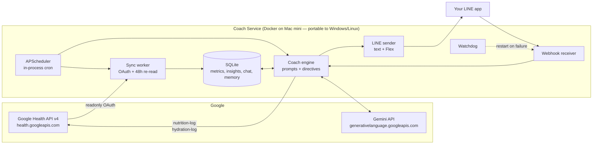

# Personal Google Health AI Coach — Design

A self-hosted service that pulls Google Health (Fitbit / Pixel Watch) data hourly,
mirrors the coaching features of **Google Health Premium Coach** using **Gemini** as
the AI engine, and delivers summaries, nudges and two-way chat over **LINE**.

*Originally designed 2026-07-14. Rewritten 2026-08-23 to describe what was actually
built — see [§9](#9-changed-since-the-original-design) for what changed and why, and
[§10](#10-operational-facts-learned-the-hard-way) for the API and model behaviour
that only surfaced in production.*

---

## 1. Research findings (why the stack looks like this)

| Question | Finding |
|---|---|
| How do I read Google Health data programmatically? | The **Google Health API** (`https://health.googleapis.com/v4/`) is the current, supported path. It launched in 2026 as the unified successor to both the Google Fit REST API (closed to new signups since May 2024, sunset end of 2026) and the Fitbit Web API (**shuts down September 2026**). It returns data from all Fitbit devices and Pixel Watches. |
| Auth model | Standard **Google OAuth 2.0** with `googlehealth.*` scopes. Since May 2026 read and write are separate scopes (`.readonly` / `.writeonly`) — logging food needs both. Scopes are "Restricted" for published apps, but a personal-use OAuth app in *Testing* mode with your own account as test user needs no verification review. |
| Data available | 31+ data types via four read methods: `list` (raw points), `reconcile` (merged across devices), `rollUp` (windowed aggregates), `dailyRollUp` (civil-day aggregates). Confirmed working on a live account: steps, total calories, active-zone-minutes, resting HR, HRV, SpO₂, respiratory rate, sleep with stages, exercise sessions, plus nutrition-log and hydration-log for writes. |
| What does Google Health Premium Coach actually do? | (So we can mirror it.) Launched May 2026 at $9.99/mo: proactive daily insights and nudges, tailored workout suggestions and multi-week adaptive plans, sleep consistency tracking, readiness/recovery analysis, cycle & nutrition insights, medical-record summaries, and a 24/7 conversational coach with memory. |
| How do I message the user? | **LINE Messaging API**. Replies to a webhook event are free and unlimited; pushes count against a per-bot monthly quota (500 on the free plan). Flex Messages give real layout — stat cards, charts, carousels — which a plain-text channel cannot. |
| Two-way chat? | LINE webhooks deliver inbound messages to our HTTPS endpoint. Every reply is free-form; there is no 24-hour service window to manage. |

**Key deadline:** anything built on the legacy Fitbit Web API dies September 2026.
Building directly on the Google Health API avoids a forced migration.

---

## 2. Architecture


```mermaid
flowchart LR
    subgraph Google
        GH[Google Health API v4<br/>health.googleapis.com]
        GEM[Gemini API<br/>generativelanguage.googleapis.com]
    end

    subgraph "Coach Service (Docker on Mac mini — portable to Windows/Linux)"
        SCHED[APScheduler<br/>in-process cron]
        ING[Sync worker<br/>OAuth + 48h re-read]
        DB[(SQLite<br/>metrics, insights, chat, memory)]
        COACH[Coach engine<br/>prompts + directives]
        LINE_OUT[LINE sender<br/>text + Flex]
        LINE_IN[Webhook receiver]
        WD[Watchdog]
    end

    PHONE[Your LINE app]

    SCHED --> ING
    GH -->|readonly OAuth| ING --> DB
    SCHED --> COACH
    DB <--> COACH
    COACH <--> GEM
    COACH -->|nutrition-log<br/>hydration-log| GH
    COACH --> LINE_OUT --> PHONE
    PHONE --> LINE_IN --> COACH
    WD -.->|restart on failure| LINE_IN
```

Three loops share one data store and one coach engine:

1. **Hourly loop** — sync the trailing 48 h; run cheap rule-based checks; call Gemini
   only when a nudge condition fires.
2. **Daily / weekly loop** — morning brief and Sunday report, dispatched per user's
   own timezone.
3. **Chat loop** — event-driven; inbound LINE message → coach → reply, including food
   and drink logging that writes back to Google Health.

---

## 3. Component design

### 3.1 Ingestion (Google Health API)

- **OAuth (per user):** each user authorizes from their phone via `/auth/google`; the
  refresh token is stored encrypted in SQLite (see DESIGN-V2). A signed `state`
  parameter binds the grant to the right LINE user, and the PKCE verifier is
  persisted between the two requests.
- **Sync strategy (hourly):** `dailyRollUp` for steps, total calories and
  active-zone-minutes; `list` for the daily HRV / SpO₂ / respiratory-rate /
  resting-HR types; `list` for sleep and exercise sessions. Always re-reads the
  trailing 48 h, because device sync lag keeps changing yesterday.
- **Idempotency:** every row is upserted on `(user_id, day, hour, data_type, source)`,
  so a re-read or a missed hour self-heals on the next run. Sessions that grow as the
  tracker syncs are matched by overlap, not by exact `(start, end)`.
- **Backfill:** a user with under 14 days of history gets a 90-day backfill once,
  chunked to respect per-type range limits.
- **Resilience:** exponential backoff on 429/5xx for reads; see §10 for why writes are
  deliberately *not* retried.

### 3.2 Storage (SQLite)

Single file — this is a personal, small-group system; Postgres is overkill.

```sql
users(line_user_id, google_token_json, gemini_api_key, timezone, language, …)
metrics(user_id, day, hour, data_type, value_json, source, updated_at)
sleep_sessions(user_id, start, end, stages_json, efficiency, score)
exercise_sessions(user_id, start, end, activity_type, stats_json)
insights(user_id, ts, kind, content, delivered)   -- briefs, nudges, food_log history
goals(user_id, key, value_json)                   -- targets, workout plan
chat_messages(user_id, ts, role, text)
coach_memory(user_id, name, content)
sync_log(user_id, ts, data_type, ok, detail)
log_messages(message_id, user_id, insight_rowid)  -- quote-reply targeting
processed_events(message_id, user_id, created_at) -- webhook exactly-once
failure_state(user_id, kind, count, notified)     -- "reconnect" notifications
```

Retention runs daily: `sync_log` past 14 days, nudge insights past 90, chat beyond the
newest 500 per user, expired dedup keys. `food_log` history is never pruned — weekly
reports read it and deletes resolve against it.

### 3.3 Coach engine (Gemini)

- **Models:** `gemini-pro-latest` primary, falling back to `gemini-3.5-flash` then
  `gemini-3.5-flash-lite`. Chosen on measured stability, not marketing — see §10.
- **Two invocation shapes:**
  1. **Scheduled narrative** — the service computes the numbers deterministically and
     renders them as Flex stat cards; Gemini writes only the interpretation. This is
     why the brief cannot invent a step count.
  2. **Chat turn** — one call with health context, recent logs, goals and memory. The
     model requests actions by emitting **directives** the service executes:
     `[MEMORY:]`, `[SET_NUTRITION_TARGETS:]`, `[CREATE_PLAN:]`, `[LOG_FOOD:]`,
     `[LOG_DRINK:]`, `[ADJUST_LAST:]`, `[DELETE_LAST:]`, `[DELETE_TODAY:]`.
- **The model never reports its own success.** The service appends the real outcome of
  every directive. Both prompts state this explicitly, because a confident "saved it"
  over a failed write is worse than no reply — see §10.
- **Safety net:** when a message plainly asks to record something and no log directive
  came back, a second single-purpose extractor call re-reads the message for just the
  payload. Prompt adherence is not reliable enough to be the only path.
- **Memory:** `coach_memory` + `goals` are loaded into every call and written back via
  directives, mirroring Google's "remembers your goals".

### 3.4 Feature parity map (vs. Google Health Premium Coach)

| Google Health Coach feature | Our implementation |
|---|---|
| Proactive daily insights & nudges | Daily brief at 10:00 local + hourly rule-triggered nudges (low steps, step streak, elevated resting HR, bedtime) |
| Readiness / recovery analysis | `stats._readiness` combines resting-HR, HRV and sleep against a 30-day baseline, with SpO₂ / respiratory-rate anomaly checks; shown as a verdict pill on the brief |
| Sleep consistency & restorative rest | Sleep stages, asleep-vs-in-bed split, week/month averages and week-over-week trend |
| Tailored workouts & adaptive plans | `[CREATE_PLAN:]` builds a multi-week plan; the current week is derived from the clock and referenced in the daily brief |
| 24/7 conversational coach with memory | LINE two-way chat + `coach_memory` |
| Nutrition insights | Food and drink logging from a photo or a sentence, written to Google Health, with daily targets and a progress card |
| Cycle insights | Not implemented |
| Medical-record summaries | Out of scope — deliberately keeping PHI out of this pipeline |

**Nudge design rule:** rules (cheap code) decide *when* to speak; Gemini decides *what
to say*. Hard cap ≤ 3 nudges/day, quiet hours 22:00–07:00 in the user's local time.

### 3.5 LINE delivery

- **Outbound:** replies use the webhook's reply token (free, unlimited) and fall back
  to a push when the token has expired. Scheduled briefs are pushes.
- **Flex Messages** carry the visual work: daily/weekly report cards with trend chips
  and a sleep-stage bar, food/drink log cards with the photo as hero image, and a
  daily nutrition progress card. Plain text is the fallback.
- **Inbound:** `POST /webhook`, HMAC-verified with the channel secret, processed in a
  background task so LINE gets its 200 immediately. Each message id is claimed exactly
  once (`processed_events`) because LINE can deliver the same event twice.
- **Formatting:** LINE has no markdown. Prompts specify emoji section markers and
  `「」` for numbers.

### 3.6 Scheduling & deployment — Mac mini, Docker

Three containers via `docker compose`, all Linux, so the setup moves unchanged to
Windows or Linux:

| Service | Role |
|---|---|
| `coach` | FastAPI webhook + APScheduler, port bound to `127.0.0.1` only |
| `tunnel` | Cloudflare Tunnel giving the webhook a stable HTTPS URL with no open ports |
| `watchdog` | Polls `coach`'s `/healthz` and cloudflared's `/ready`, restarts either via the Docker API after 3 consecutive failures, and reports over LINE |

| Job | When |
|---|---|
| Health sync | hourly at :05 |
| Nudge check | hourly at :35 |
| Daily brief | hourly dispatch, fires at 10:00 in each user's local time |
| Weekly report | hourly dispatch, fires Sunday 09:00 local |
| Temp image prune | hourly at :50 |
| DB retention prune | daily at 04:20 |

Design decisions that make this portable:

- **Scheduler inside the app process** (APScheduler), not host cron/launchd — zero
  OS-specific config. `misfire_grace_time` lets a job that missed its slot still fire.
- **Per-user timezones.** The daily and weekly senders are hourly *dispatchers* that
  check each user's local clock, and every window in `stats.py` is measured against
  the user's day, not the server's.
- **State in one bind-mounted folder** (`./data`): SQLite DB and temp images. Migrating
  machines is copy the repo + `data/` + `.env`, then `docker compose up -d`.
- **Secrets in `.env`** (git-ignored), injected as env vars. Per-user Google tokens and
  Gemini keys are Fernet-encrypted in the DB.
- **Downtime tolerance:** the hourly sync always re-reads 48 h, so an outage self-heals.
  LINE retries inbound messages for a period; the dedup table makes those retries safe.

---

## 4. Message examples

**Daily brief (10:00 local)** — a Flex card: a readiness pill, itemized recovery /
sleep / activity rows with ▲▼ trend chips against the 7-day average, a proportional
sleep-stage bar, and one short Gemini-written "Today's Focus" paragraph. The numbers
are rendered from the database; only the prose comes from the model.

**Food log** — photo or sentence in, a Flex card back: item name, the headline stat,
macro rows, and a one-line coaching tip grounded in today's real totals versus target,
swipeable to a progress card.

**Nudge (rule-triggered):**

> 🚶 It's 15:35 and you've only logged 1,200 steps today. You average 9,454 steps a day
> over the past month — a 15-minute walk now would close most of the gap.

---

## 5. Cost estimate

| Item | Volume | Est. monthly cost |
|---|---|---|
| Google Health API | hourly sync + writes | Free |
| Gemini | ~15–30 calls/day on the user's own key | On the user (free tier has covered it so far) |
| LINE Messaging API | replies free; pushes ~2–5/day | Free (500 pushes/month) |
| Hosting | Mac mini you already own + Cloudflare Tunnel free tier | ~$0 + electricity |

Each user brings their own Gemini key, so AI cost scales per person and never lands on
the operator.

---

## 6. Security & privacy

- Health data is sensitive: the OAuth app stays in **Testing** mode, so only accounts
  added as test users can grant access. Secrets live in a git-ignored `.env`; `data/`
  is never committed.
- Per-user Google tokens and Gemini keys are **Fernet-encrypted** at rest with a
  server-side `ENCRYPTION_KEY`.
- The webhook port binds to `127.0.0.1`; the only public entry point is the Cloudflare
  Tunnel, so nothing on the LAN or router is exposed.
- Every inbound request is HMAC-verified (`X-Line-Signature`). The local `/chat`
  endpoint is reachable through the tunnel, so it is disabled unless `CHAT_TEST_TOKEN`
  is set and presented, and answers 404 otherwise.
- **Every query is scoped by `user_id`.** No endpoint exposes another user's data.
- Temp photos are served under an unguessable token, only for paths this process
  minted, and pruned after 24 h.
- No medical records enter the pipeline — deliberately out of scope.

---

## 7. Implementation status

| Phase | Deliverable | State |
|---|---|---|
| 1. Pipes | OAuth + hourly sync into SQLite; LINE sending | Done |
| 2. Daily coach | Snapshot → Gemini narrative → Flex brief at 10:00 local | Done |
| 3. Nudges | Rule engine + rate limiting + quiet hours | Done |
| 4. Chat | Webhook, directive-driven agent, conversation memory | Done |
| 5. Plans & trends | Multi-week plans, weekly report, readiness scoring | Done |
| 6. Multi-user | Per-user tokens/keys, encryption, web OAuth | Done — see DESIGN-V2 |
| 7. Nutrition | Photo and text food/drink logging written to Google Health | Done |

Stack: **Python 3.12**, `google-genai`, `google-auth` + `requests` for the Health API,
`FastAPI`, `APScheduler`, `sqlite3`, `Pillow`, `line-bot-sdk`. Dependencies are pinned
exactly (see `requirements.txt`) so a rebuild deploys what was tested.

Tests: `tests/` runs offline on a throwaway database (`python -m unittest discover`);
`tests/manual/` holds checks that need live APIs.

---

## 8. Sources

- [Google Fit deprecation & migration FAQ](https://developer.android.com/health-and-fitness/health-connect/migration/fit/faq) · [Google Fit REST API](https://developers.google.com/fit/rest)
- [About the Google Health API](https://developers.google.com/health/about) · [Release notes](https://developers.google.com/health/release-notes) · [Error catalog](https://developers.google.com/health/reference/rest/v4/errors) · [Scopes](https://developers.google.com/health/scopes)
- [Google blog: Google Health Coach for Premium users](https://blog.google/products-and-platforms/products/google-health/google-health-coach/) · [9to5Google: Google Health app replaces Fitbit](https://9to5google.com/2026/05/07/google-health-app-fitbit/)
- [LINE Messaging API](https://developers.line.biz/en/docs/messaging-api/) · [Flex Messages](https://developers.line.biz/en/docs/messaging-api/using-flex-messages/)
- [Gemini API changelog](https://ai.google.dev/gemini-api/docs/changelog) · [Gemini deprecations](https://ai.google.dev/gemini-api/docs/deprecations)

---

## 9. Changed since the original design

The 2026-07-14 design specified **Claude** as the AI engine and **WhatsApp** as the
channel. Both were replaced before the first release, and this document described a
system that never existed for about six weeks. What actually happened:

| Original | Built | Why |
|---|---|---|
| Claude Opus 4.8 | Gemini (`gemini-pro-latest`) | Each user brings their own API key, and a free Gemini tier covers a personal coach. The Google Health data and the model then sit behind the same Google account. |
| WhatsApp Cloud API | LINE Messaging API | The users are in Thailand, where LINE is the default messenger. LINE also has no 24-hour service window to manage, and Flex Messages allow real card layouts — the daily brief and food log cards depend on that. |
| Anthropic tool-runner agent | Directives in the reply text | Simpler to run against a plain `generateContent` call, and the service stays the only thing that touches the database or Google Health. |
| Single user, token in a file | Per-user tokens encrypted in SQLite | See DESIGN-V2. |

The cost picture changed with it: the original estimate was ~$5/month of Anthropic API
on the operator's key. Now AI cost sits on each user's own key and the operator pays
for electricity.

---

## 10. Operational facts learned the hard way

Behaviour that is not in the docs, or that the docs state and we only believed after
being bitten. Each one is enforced in code and covered by a test.

**Google Health API**

- **A client can only delete data points it wrote.** `dataPoints:batchDelete` answers
  `403 PERMISSION_DENIED` / `DATA_POINT_NOT_OWNED_BY_CLIENT`, and it rejects the
  **whole request** if one foreign name is in the list — so "delete all of today"
  removed nothing at all while another app had entries on the same day. Filter to our
  own points before asking. Neither the API reference nor the Health Connect docs state
  this; only the error does.
- **`batchDelete` accepts at most 10,000 names per request**, and an oversized call
  fails entirely. Chunked at 500.
- **A 200 is not proof.** After deleting, re-read and confirm. Reporting the number of
  names *attempted* told users "cleared 12 meals" when nothing had gone away.
- **Writes must not be retried on 5xx.** A `create` that the server applied but failed
  to acknowledge becomes a duplicate entry on retry. 429 is still retried — that
  response means the request was rejected outright.
- **`list` allows `pageSize` up to 10,000 — except `sleep` and `exercise`, capped at
  25.** Larger values are silently clamped today, which is not something to rely on.
- **Filter fields differ per data type.** `sleep` accepts
  `sleep.interval.civil_end_time`; `exercise` only accepts `civil_start_time`.
- **The totals aggregate every app on the device.** A Health Connect bridge
  (`nl.appyhapps.healthsync`) mirrored this account's meals back in 19,673 times and
  the progress card read 820,981 kcal against a 3,200 target. Google Health is now
  cross-checked against our own logged history: an absurd multiple of the user's target
  is rejected, a milder mismatch is logged, and each metric takes the higher of the two
  so an external deletion cannot make the card under-report.
- **Uninstalling the offending app does not remove what it wrote**, and neither the
  Google Health app nor Health Connect could bulk-delete it. Assume foreign data is
  permanent and defend the *reading* path.

**Gemini**

- **`google-genai` applies no request timeout.** One `generateContent` call hung for
  30 m 32 s before answering 502; the reply arrived long after the LINE reply token had
  died, and looked to the user like the message was ignored. Requests now carry an
  explicit 120 s bound.
- **The SDK retries 5 times by default against the same model.** That competes with —
  and delays — our own rotation, which moves to a different capacity tier, parks a model
  whose daily quota is spent, and honours a server `retryDelay`. Disabled
  (`attempts=1`).
- **Thinking tokens share `max_output_tokens`.** At 2,103 tokens for HIGH they will
  truncate the reply, and for a chat turn that means silently losing the trailing
  `[LOG_FOOD]` directive. All calls now budget 4,096.
- **`thinking_level: MINIMAL` is rejected** (`400 INVALID_ARGUMENT`) as of 2026-08-23.
  `MEDIUM` and `HIGH` answer 503 on the flash tiers. `LOW` is the highest level
  universally available.
- **The `*-latest` aliases are the least stable thing in the account.** Measured with 5
  identical calls per model, `gemini-flash-latest` was the only failure (3/5:
  ConnectError + 503) while every pinned model answered 5/5. An alias tracks the newest
  release and rides the least settled capacity.
- **Prompt adherence is not a guarantee.** The model will answer a log request with a
  fluent "บันทึกแล้ว" and no directive, so nothing is saved while the user is told it
  was. Anything that must happen needs a deterministic path, not just an instruction.
- **The model's own history is a prompt.** Successful logs used to store an empty coach
  turn and failed ones stored the prose claim; read back as few-shot examples, that
  taught the model to stop emitting directives. What the coach actually *did* is now
  recorded in the turn.

**LINE**

- **The same event can arrive twice without the `isRedelivery` flag**, which logged one
  meal as two. Message ids are claimed exactly once.
- **Reply tokens are short-lived and single-use.** Any slow path must fall back to a
  push, and those count against the monthly quota.
- **Delivered photos are already downscaled** (≤ ~1.64 MP, ~250 KB observed), so the
  "phone photos are 2–4 MB" premise for compressing them did not hold here.
